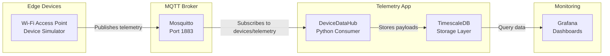
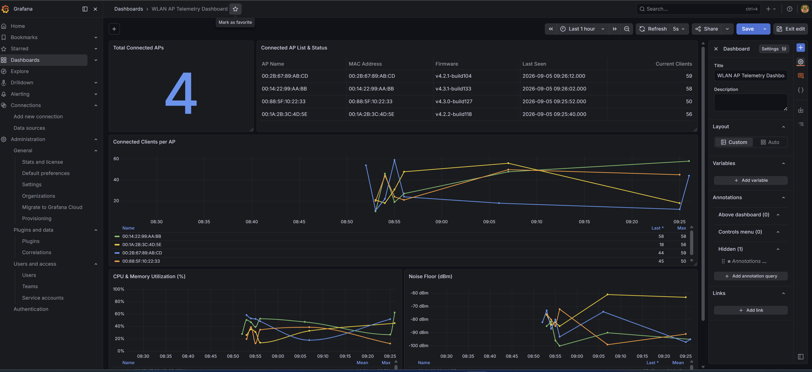

# DeviceDataHub

DeviceDataHub is a lightweight IoT telemetry pipeline for collecting MQTT device data, storing it in TimescaleDB, and visualizing it in Grafana.

The project is designed for local development and for Docker-based deployments. It listens for telemetry from connected devices, persists the raw and parsed payloads, and keeps a simple path to operational monitoring.

## MQTT topic

The default MQTT topic used by the app is:

`devices/telemetry`

This is the topic the simulated device publishes to and the consumer subscribes to by default. You can override it at runtime with:

```bash
export MQTT_TOPIC="devices/telemetry"
```

For example, a device can publish JSON telemetry like this:

```json
{
  "timestamp": 1725451200,
  "device_id": "sensor-001",
  "temperature": 22.5,
  "humidity": 45.7,
  "battery": 88.2
}
```

## What it does

- Connects to an MQTT broker
- Subscribes to the configured telemetry topic
- Parses incoming JSON payloads
- Stores telemetry data in TimescaleDB
- Creates the telemetry table automatically if it does not exist
- Prints incoming device payloads for debugging and local monitoring

## Project layout

- `src/main.py` – application entry point
- `src/mqtt_client/config.py` – environment configuration
- `src/mqtt_client/client.py` – MQTT consumer logic
- `src/mqtt_client/storage.py` – TimescaleDB persistence logic
- `src/simulate_device.py` – test sender for local development
- `docker-compose.yml` – broker + TimescaleDB + app stack
- `mosquitto.conf` – local Mosquitto broker configuration
- `grafana/` – Grafana provisioning and dashboards

## Local development

1. Create a virtual environment:
   ```bash
   python3 -m venv .venv
   source .venv/bin/activate
   ```
2. Install dependencies:
   ```bash
   pip install -r requirements.txt
   ```
3. Start the local services with Docker Compose:
   ```bash
   docker compose up -d mqtt-broker timescaledb
   ```
4. Start the telemetry consumer:
   ```bash
   MQTT_BROKER_HOST=localhost PYTHONPATH=src python src/main.py
   ```
5. In another terminal, publish sample telemetry:
   ```bash
   MQTT_BROKER_HOST=localhost PYTHONPATH=src python src/simulate_device.py
   ```

The simulator publishes JSON telemetry to `devices/telemetry` every few seconds, giving you a working stream for local testing and dashboard verification.

## Run everything with Docker Compose

```bash
docker compose up --build
```

This starts:
- `mqtt-broker` on port `1883`
- `timescaledb` on host port `5433` and container port `5432`
- `mqtt-server` as the telemetry consumer and storage writer
- `grafana` for dashboards and monitoring

## Database schema

The app creates this table automatically if missing:

```sql
CREATE TABLE IF NOT EXISTS public.telemetry (
    id BIGSERIAL PRIMARY KEY,
    event_time TIMESTAMPTZ NOT NULL DEFAULT NOW(),
    device_id TEXT,
    topic TEXT NOT NULL,
    payload JSONB,
    raw_payload TEXT,
    created_at TIMESTAMPTZ NOT NULL DEFAULT NOW()
);

SELECT create_hypertable('public.telemetry', 'event_time', if_not_exists => TRUE);
```

## Configuration

The key runtime settings live in environment variables:

```bash
MQTT_BROKER_HOST=localhost
MQTT_BROKER_PORT=1883
MQTT_CLIENT_ID=device-datahub-client
MQTT_TOPIC=devices/telemetry
MQTT_QOS=0
DB_HOST=timescaledb
DB_PORT=5432
DB_NAME=telemetry
DB_USER=postgres
DB_PASSWORD=postgres
```

## Cloud deployment

Set the same environment values to your cloud MQTT broker and database endpoints. DeviceDataHub will create the telemetry table automatically on startup when the database is reachable.

## Architecture




